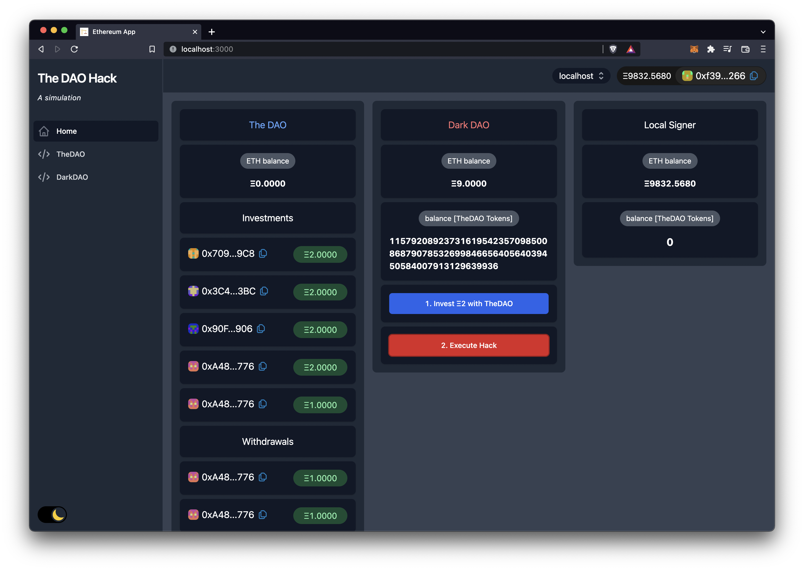
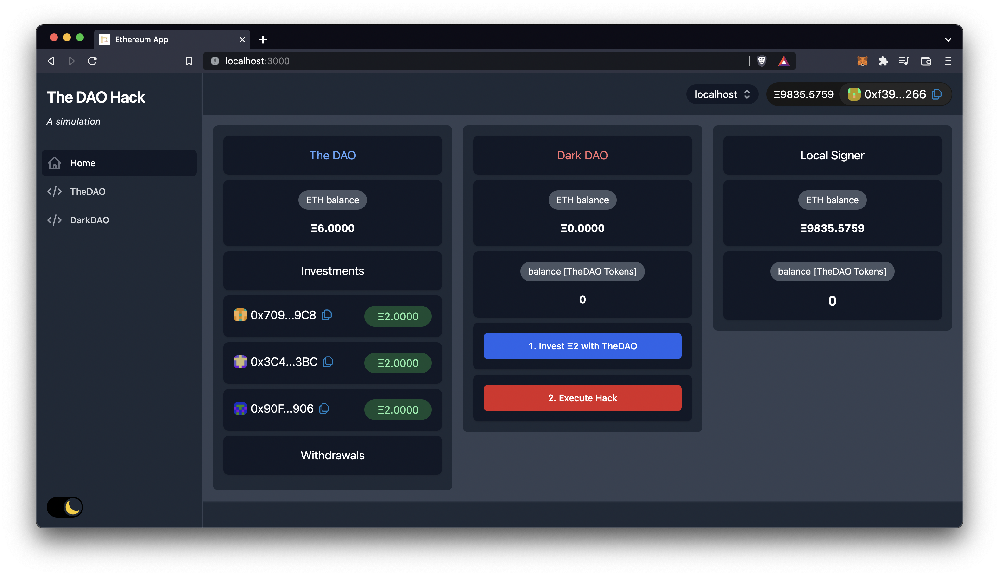
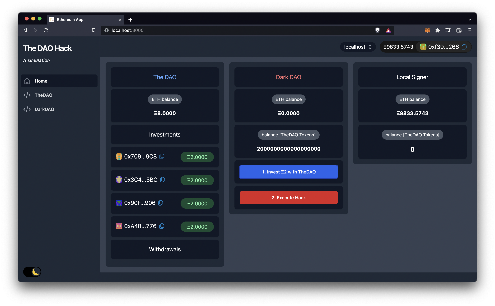

# The DAO Hack Simulation

UI + Smart Contracts for illustrating the infamous 2016 Ethereum DAO hack.



## Getting started

```bash
# install dependencies
$ yarn

# 1. terminal
# start local chain
$ yarn chain

# 2. terminal
# deploy contracts
$ yarn deploy

# start app
$ yarn start
```

## Project Structure

The projects contains two smart contracts located in `pakages/hardhat/contracts/`:

```text
TheDAO.sol
```

and

```text
DarkDAO.sol
```

On executing `yarn deploy`, several accounts deposit ETH into `TheDAO.sol`.
Then the `DarkDAO.sol`can be used to attack and drain the funds from `TheDAO.sol`.

For the attack to work, the DarkDAO first needs to hold some shares/tokens form TheDAO. This is done by calling the `function invest(address _to)` function of `TheDAO.sol` and passing the DarkDAO contract address.

Then the `attack(address _target)` function of the DarkDAO contract is executed (calling `invest()` and `withdraw()` in the same transaction).

The `withdraw()` function sends ETH funds from TheDAO back to the DarkDAO.
This triggers the `fallback() external payable` function and the re-entrancy attack is executed by calling the `withdraw()` function again.
This triggers a loop where TheDAO sends all its ETH to the DarkDAO until it is empty.

## Screenshots





## DAO Hack history

Have you ever wondered why there are two Ethereums listed on most exchanges and token lists, Ethereum and Ethereum Classic?

Back in 2016 the German company slock.it created one of the first DAO contracts on Ethereum. The contract quickly gained in popularity, collecting almost 15% of the total ETH supply.

Then on 19th of June, Martin Koeppelman (CEO of Gnosis) submitted a post on
r/ethereum: "[I think The DAO is getting drained right now](https://www.reddit.com/r/ethereum/comments/4oi2ta/i_think_thedao_is_getting_drained_right_now/)", alerting the community that an attack was happening.

Read up on the full event in more detail [here](https://github.com/ethereumbook/ethereumbook/blob/develop/appdx-forks-history.asciidoc).

Further reading:

* [Ethereum Foundation statement](https://blog.ethereum.org/2016/06/17/critical-update-re-dao-vulnerability/)
* [Martin Koeppelman DAO FAQ](https://www.reddit.com/r/ethereum/comments/4os7l5/the_big_thedao_heist_faq/)
* [Overview of relevant transactions of the hack](https://medium.com/@oaeee/the-rise-of-the-dark-dao-72b21a2212e3#.rnb1n01h8)

## Resources

* [scaffold-eth](https://github.com/scaffold-eth/scaffold-eth)

## License

MIT
